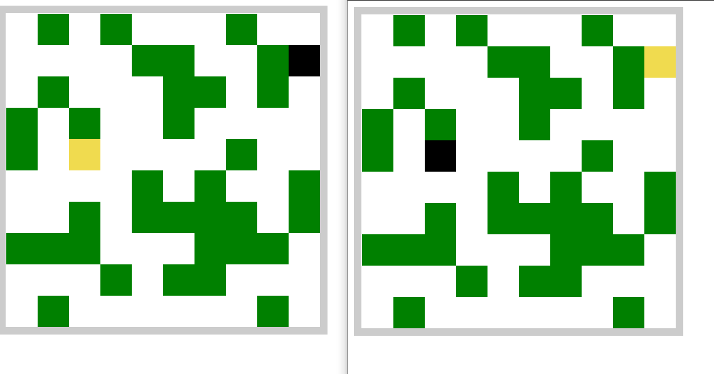

# Game Multiplayer

Development of a multiplayer game using javascript and canvas.

# Tools Useds

* [NodeJS](https://nodejs.org/en/)
* [SocketIO](https://socket.io/)
* [Canvas](https://canvasjs.com/)

# Setup Enviroment

Install the libraries npm:

```sh
$ npm i
```

# Start Game

For start the game run the code in root:

```
$ npm start
```

Open the navigator and write in browser: `localhost:3000`.

# Contacts

For errors or bugs, contact me with matheussilvamartins1714@gmail.com.